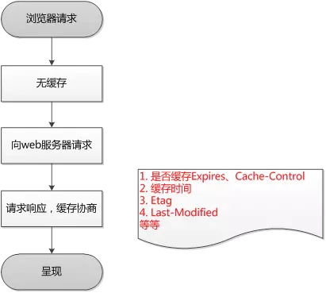
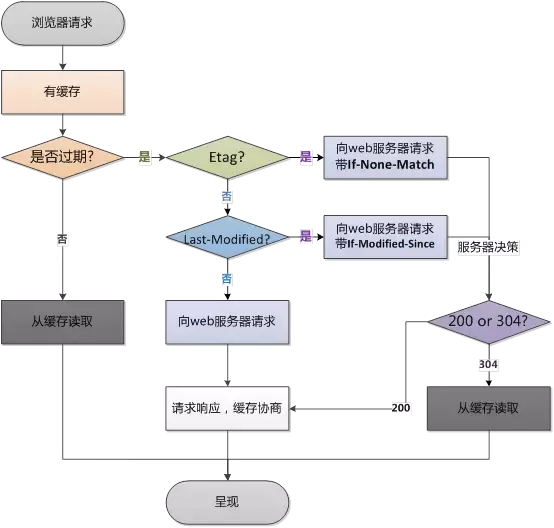

### http:（超文本传输协议）

---
含义：是一个在计算机世界里专门两点之间传输文字，图片，音频及视频等的超文本数据的约定和规范。

http是灵活可扩展的，是一个‘可靠’的传输协议，是应用层协议，使用了请求-应答模式，客户主动发起，本质上是无状态的，每个请求都是相互独立，毫无关联的。
明文传输，不安全

---
版本：
* http/0.9：只有一个命令get，没有header等描述数据的信息，服务器发送数据完毕之后就关闭tco连接
* http/1.0：增加了head，post一些新命令，状态码，还有header等
* http/1.1： 增加了put，delete等新方法，增加了缓存管理和控制，允许持久连接（默认开启，connection：keep-alive，使用同一个tcp连接来发送和接收多个http请求与应答，而不是为每一个新的请求打开一个新的tcp，较少的cpu和内存的使用，降低了拥塞控制，后续无需进行tcp握手），强制要求host头，让主机托管成为可能
* http/2.0：以二进制传输文件数据，多路复用，头部压缩，服务器推送

---
HTTP2.0的多路复用和HTTP1.X中的长连接复用有什么区别？

* HTTP/1.* 一次请求-响应，建立一个连接，用完关闭；每一个请求都要建立一个连接；

* HTTP/1.1 Pipeling解决方式为，若干个请求排队串行化单线程处理，后面的请求等待前面请求的返回才能获得执行机会，一旦有某请求超时等，后续请求只能被阻塞，毫无办法，也就是人们常说的线头阻塞；

* HTTP/2多个请求可同时在一个连接上并行执行。某个请求任务耗时严重，不会影响到其它连接的正常执行

服务器推送到底是什么？
* 服务端推送能把客户端所需要的资源伴随着index.html一起发送到客户端，省去了客户端重复请求的步骤。正因为没有发起请求，建立连接等操作，所以静态资源通过服务端推送的方式可以极大地提升速度。

---

http的请求报文和响应报文的结构基本相同

首行 | **
---|---
首部 | -------------
空行 | -------------
主体 | -------------


------

### 缓存：

第一次请求：



第二次请求相同网页：



缓存的类别
浏览器缓存分为强缓存和协商缓存

#### 强缓存：

浏览器不会像服务器发送任何请求，直接从本地缓存中读取文件并返回Status Code: 200 OK

* 200 form memory cache :
不访问服务器，一般已经加载过该资源且缓存在了内存当中，直接从内存中读取缓存。浏览器关闭后，数据将不存在（资源被释放掉了），再次打开相同的页面时，不会出现from memory cache。
* 200 from disk cache：
不访问服务器，已经在之前的某个时间加载过该资源，直接从硬盘中读取缓存，关闭浏览器后，数据依然存在，此资源不会随着该页面的关闭而释放掉下次打开仍然会是from disk cache。
* 优先访问memory cache,其次是disk cache，最后是请求网络资源

协商缓存: 向服务器发送请求，服务器会根据这个请求的request header的一些参数来判断是否命中协商缓存，如果命中，则返回304状态码并带上新的response header通知浏览器从缓存中读取资源

强缓存：
Expires：过期时间，如果设置了时间，则浏览器会在设置的时间内直接读取缓存，不再请求
Cache-Control：当值设为max-age=30时，则代表在这个请求正确返回时间（浏览器也会记录下来）的30s内再次加载资源，就会命中强缓存。

```
（1）max-age：用来设置资源（representations）可以被缓存多长时间，单位为秒；
（2）s-maxage：和max-age是一样的，不过它只针对代理服务器缓存而言；
（3）public：指示响应可被任何缓存区缓存；
（4）private：只能针对个人用户，而不能被代理服务器缓存；
（5）no-cache：强制客户端直接向服务器发送请求,也就是说每次请求都必须向服务器发送。服务器接收到     请求，然后判断资源是否变更，是则返回新内容，否则返回304，未变更。这个很容易让人产生误解，使人误     以为是响应不被缓存。实际上Cache-Control:     no-cache是会被缓存的，只不过每次在向客户端（浏览器）提供响应数据时，缓存都要向服务器评估缓存响应的有效性。
（6）no-store：禁止一切缓存（这个才是响应不被缓存的意思）。
```
cache-control是http1.1的头字段，expires是http1.0的头字段,如果expires和cache-control同时存在，cache-control会覆盖expires，建议两个都写。

---
#### 协商缓存：

Last-Modifued/If-Modified-Since和Etag/If-None-Match是分别成对出现的，呈一一对应关系
##### Etag/If-None-Match：
Etag：

- Etag是属于HTTP 1.1属性，它是由服务器（Apache或者其他工具）生成返回给前端，用来帮助服务器控制Web端的缓存验证。
- Apache中，ETag的值，默认是对文件的索引节（INode），大小（Size）和最后修改时间（MTime）进行Hash后得到的。

If-None-Match:

- 当资源过期时，浏览器发现响应头里有Etag,则再次向服务器请求时带上请求头if-none-match(值是Etag的值)。服务器收到请求进行比对，决定返回200或304


##### Last-Modified/If-Modified-Since：
Last-Modified：

- 浏览器向服务器发送资源最后的修改时间

If-Modified-Since：


- 当资源过期时（浏览器判断Cache-Control标识的max-age过期），发现响应头具有Last-Modified声明，则再次向服务器请求时带上头if-modified-since，表示请求时间。服务器收到请求后发现有if-modified-since则与被请求资源的最后修改时间进行对比（Last-Modified）,若最后修改时间较新（大），说明资源又被改过，则返回最新资源，HTTP 200 OK;若最后修改时间较旧（小），说明资源无新修改，响应HTTP 304 走缓存。

```
Last-Modifued/If-Modified-Since的时间精度是秒，而Etag可以更精确。
Etag优先级是高于Last-Modifued的，所以服务器会优先验证Etag
Last-Modifued/If-Modified-Since是http1.0的头字段
```

#### 状态码：
- 100	Continue	继续。客户端应继续其请求
- 101	Switching Protocols	切换协议。服务器根据客户端的请求切换协议。只能切换到更高级的协议，例如，切换到HTTP的新版本协议
- 200	OK	请求成功。一般用于GET与POST请求
- 201	Created	已创建。成功请求并创建了新的资源
- 202	Accepted	已接受。已经接受请求，但未处理完成
- 203	Non-Authoritative Information	非授权信息。请求成功。但返回的meta信息不在原始的服务器，而是一个副本
- 204	No Content	无内容。服务器成功处理，但未返回内容。在未更新网页的情况下，可确保浏览器继续显示当前文档
- 205	Reset Content	重置内容。服务器处理成功，用户终端（例如：浏览器）应重置文档视图。可通过此返回码清除浏览器的表单域
- 206	Partial Content	部分内容。服务器成功处理了部分GET请求
- 300	Multiple Choices	多种选择。请求的资源可包括多个位置，相应可返回一个资源特征与地址的列表用于用户终端（例如：浏览器）选择
- 301	Moved Permanently	永久移动。请求的资源已被永久的移动到新URI，返回信息会包括新的URI，浏览器会自动定向到新URI。今后任何新的请求都应使用新的URI代替
- 302	Found	临时移动。与301类似。但资源只是临时被移动。客户端应继续使用原有URI
- 303	See Other	查看其它地址。与301类似。使用GET和POST请求查看
- 304	Not Modified	未修改。所请求的资源未修改，服务器返回此状态码时，不会返回任何资源。客户端通常会缓存访问过的资源，通过提供一个头信息指出客户端希望只返回在指定日期之后修改的资源
- 305	Use Proxy	使用代理。所请求的资源必须通过代理访问
- 306	Unused	已经被废弃的HTTP状态码
- 307	Temporary Redirect	临时重定向。与302类似。使用GET请求重定向
- 400	Bad Request	客户端请求的语法错误，服务器无法理解
- 401	Unauthorized	请求要求用户的身份认证
- 402	Payment Required	保留，将来使用
- 403	Forbidden	服务器理解请求客户端的请求，但是拒绝执行此请求
- 404	Not Found	服务器无法根据客户端的请求找到资源（网页）。通过此代码，网站设计人员可设置"您所请求的资源无法找到"的个性页面
- 405	Method Not Allowed	客户端请求中的方法被禁止
- 406	Not Acceptable	服务器无法根据客户端请求的内容特性完成请求
- 407	Proxy Authentication Required	请求要求代理的身份认证，与401类似，但请求者应当使用代理进行授权
- 408	Request Time-out	服务器等待客户端发送的请求时间过长，超时
- 409	Conflict	服务器完成客户端的 PUT 请求时可能返回此代码，服务器处理请求时发生了冲突
- 410	Gone	客户端请求的资源已经不存在。410不同于404，如果资源以前有现在被永久删除了可使用410代码，网站设计人员可通过301代码指定资源的新位置
- 411	Length Required	服务器无法处理客户端发送的不带Content-Length的请求信息
- 412	Precondition Failed	客户端请求信息的先决条件错误
- 413	Request Entity Too Large	由于请求的实体过大，服务器无法处理，因此拒绝请求。为防止客户端的连续请求，服务器可能会关闭连接。如果只是服务器暂时无法处理，则会包含一个Retry-After的响应信息
- 414	Request-URI Too Large	请求的URI过长（URI通常为网址），服务器无法处理
- 415	Unsupported Media Type	服务器无法处理请求附带的媒体格式
- 416	Requested range not satisfiable	客户端请求的范围无效
- 417	Expectation Failed	服务器无法满足Expect的请求头信息
- 500	Internal Server Error	服务器内部错误，无法完成请求
- 501	Not Implemented	服务器不支持请求的功能，无法完成请求
- 502	Bad Gateway	作为网关或者代理工作的服务器尝试执行请求时，从远程服务器接收到了一个无效的响应
- 503	Service Unavailable	由于超载或系统维护，服务器暂时的无法处理客户端的请求。延时的长度可包含在服务器的Retry-After头信息中
- 504	Gateway Time-out	充当网关或代理的服务器，未及时从远端服务器获取请求
- 505	HTTP Version not supported	服务器不支持请求的HTTP协议的版本，无法完成处理

---


