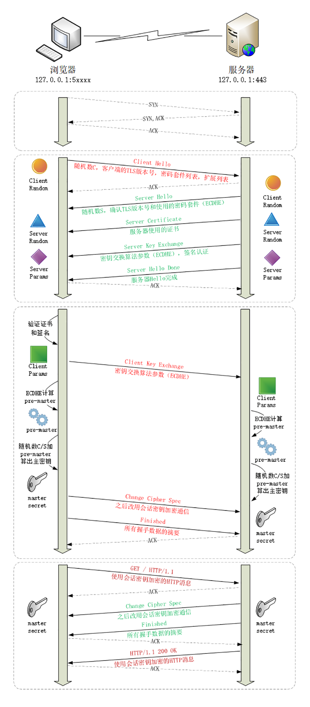

### HTTPS协议
#### 概念
- 超文本传输安全协议（英语：Hypertext Transfer Protocol Secure，缩写：HTTPS，常称为HTTP over TLS，HTTP over SSL或HTTP Secure）是一种通过计算机网络进行安全通信的传输协议。
- HTTPS经由HTTP进行通信，但利用SSL/TLS来加密数据包。
- HTTPS开发的主要目的，是提供对网站服务器的身份认证，保护交换数据的隐私与完整性。
- 简而言之: HTTPS是在HTTP上建立SSL加密层，并对传输数据进行加密，是HTTP协议的安全版。

#### HTTPS比HTTP多了一层TLS/SSL协议

- TLS/SSL全称安全传输层协议Transport Layer Security, 是介于TCP和HTTP之间的一层安全协议，不影响原有的TCP协议和HTTP协议，所以使用HTTPS基本上不需要对HTTP页面进行太多的改造。
- HTTPS原理
- 这部分细说起来,真的很多.这里我归纳简单说一下:
- 
- 客户端向服务器端索要并验证公钥。这一阶段使用的是非对称加密传输(RSA),服务端将数字证书发给客户端.其中数字证书包括:公钥和数字签名.客户端在拿到后对两者进行校验.
- 在非对称加密传输中,两端协商生成"对话密钥"。
- 双方采用"对话密钥"进行对称加密通信。
- 
- 受限于篇幅,我就不展开了.要不然就太多太多了.这里我推荐几篇文章大家全面理解:

#### HTTP 与 HTTPS 的区别

- HTTP 是明文传输，HTTPS 通过 SSL\TLS 进行了加密
- HTTP 的端口号是 80，HTTPS 是 443
- HTTPS 需要到 CA 申请证书，一般免费证书很少，需要交费
- HTTP 的连接很简单，是无状态的；HTTPS 协议是由 SSL+HTTP 协议构建的可进行加密传输、身份认证的网络协议，比 HTTP 协议安全。
#### HTTPS主要作用是：

对数据进行加密，并建立一个信息安全通道，来保证传输过程中的数据安全
对网站服务器进行真实身份认证

#### HTTPS缺点


```
HTTPS协议握手阶段比较费时，会使页面的加载时间延长近50%，增加10%到20%的耗电；
https连接缓存不如http高效，如果是大流量网站,则会造成流量成本太高。
https连接服务器端资源占用高很多，支持访客稍多的网站需要投入更大的成本，如果全部采用https，基于大部分计算资源闲置的假设的VPS的平均成本会上去。
SSL证书需要钱，功能越强大的证书费用越高，个人网站、小网站没有必要一般不会用。
SSL证书通常需要绑定IP，不能再同一IP上绑定多个域名，IPv4资源不可能支撑这个消耗(SSL有扩展可以部分解决这个问题，但是比较麻烦，而且要求浏览器、操作系统支持，Windows XP就不支持这个扩展，考虑到XP的装机量，这个特性几乎没用)。
```


#### HTTPS接入优化
 CDN接入
- HTTPS 增加的延时主要是传输延时 RTT，RTT 的特点是节点越近延时越小，CDN 天然离用户最近，因此选择使用 CDN 作为 HTTPS 接入的入口，将能够极大减少接入延时。CDN 节点通过和业务服务器维持长连接、会话复用和链路质量优化等可控方法，极大减少 HTTPS 带来的延时。

会话缓存
- 虽然前文提到 HTTPS 即使采用会话缓存也要至少1*RTT的延时，但是至少延时已经减少为原来的一半，明显的延时优化;同时，基于会话缓存建立的 HTTPS 连接不需要服务器使用RSA私钥解密获取 Pre-master 信息，可以省去CPU 的消耗。如果业务访问连接集中，缓存命中率高，则HTTPS的接入能力讲明显提升。当前TRP平台的缓存命中率高峰时期大于30%，10k/s的接入资源实际可以承载13k/的接入，收效非常可观。

硬件加速
- 为接入服务器安装专用的SSL硬件加速卡，作用类似 GPU，释放 CPU，能够具有更高的 HTTPS 接入能力且不影响业务程序的。测试某硬件加速卡单卡可以提供35k的解密能力，相当于175核 CPU，至少相当于7台24核的服务器，考虑到接入服务器其它程序的开销，一张硬件卡可以实现接近10台服务器的接入能力。

远程解密
- 本地接入消耗过多的 CPU 资源，浪费了网卡和硬盘等资源，考虑将最消耗 CPU 资源的RSA解密计算任务转移到其它服务器，如此则可以充分发挥服务器的接入能力，充分利用带宽与网卡资源。远程解密服务器可以选择 CPU 负载较低的机器充当，实现机器资源复用，也可以是专门优化的高计算性能的服务器。当前也是 CDN 用于大规模HTTPS接入的解决方案之一。
#### SPDY/HTTP2

```
前面的方法分别从减少传输延时和单机负载的方法提高 HTTPS;
接入性能，但是方法都基于不改变 HTTP;
协议的基础上提出的优化方法，SPDY/HTTP2 利用 TLS/SSL;
带来的优势，通过修改协议的方法来提升 HTTPS 的性能，提高下载速度等
```

#### ECDHE 握手过程
刚才你看到的是握手过程的简要图，我又画了一个详细图，对应 Wireshark 的抓包，下面我就用这个图来仔细剖析 TLS 的握手过程。



在 TCP 建立连接之后，浏览器会首先发一个“Client Hello”消息，也就是跟服务器“打招呼”。里面有客户端的版本号、支持的密码套件，还有一个随机数（Client Random），用于后续生成会话密钥。
```
Handshake Protocol: Client Hello
    Version: TLS 1.2 (0x0303)
    Random: 1cbf803321fd2623408dfe…
    Cipher Suites (17 suites)
        Cipher Suite: TLS_ECDHE_RSA_WITH_AES_128_GCM_SHA256 (0xc02f)
        Cipher Suite: TLS_ECDHE_RSA_WITH_AES_256_GCM_SHA384 (0xc030)
```

这个的意思就是：“我这边有这些这些信息，你看看哪些是能用的，关键的随机数可得留着。”

作为“礼尚往来”，服务器收到“Client Hello”后，会返回一个“Server Hello”消息。把版本号对一下，也给出一个随机数（Server Random），然后从客户端的列表里选一个作为本次通信使用的密码套件，在这里它选择了
```
“TLS_ECDHE_RSA_WITH_AES_256_GCM_SHA384”。

Handshake Protocol: Server Hello
    Version: TLS 1.2 (0x0303)
    Random: 0e6320f21bae50842e96…
    Cipher Suite: TLS_ECDHE_RSA_WITH_AES_256_GCM_SHA384 (0xc030)
```
这个的意思就是：“版本号对上了，可以加密，你的密码套件挺多，我选一个最合适的吧，用椭圆曲线加 RSA、AES、SHA384。我也给你一个随机数，你也得留着。”

然后，服务器为了证明自己的身份，就把证书也发给了客户端（Server Certificate）。

接下来是一个关键的操作，因为服务器选择了 ECDHE 算法，所以它会在证书后发送“Server Key Exchange”消息，里面是椭圆曲线的公钥（Server Params），用来实现密钥交换算法，再加上自己的私钥签名认证。
```
Handshake Protocol: Server Key Exchange
    EC Diffie-Hellman Server Params
        Curve Type: named_curve (0x03)
        Named Curve: x25519 (0x001d)
        Pubkey: 3b39deaf00217894e...
        Signature Algorithm: rsa_pkcs1_sha512 (0x0601)
        Signature: 37141adac38ea4...
```
这相当于说：“刚才我选的密码套件有点复杂，所以再给你个算法的参数，和刚才的随机数一样有用，别丢了。为了防止别人冒充，我又盖了个章。”

之后是“Server Hello Done”消息，服务器说：“我的信息就是这些，打招呼完毕。”

这样第一个消息往返就结束了（两个 TCP 包），结果是客户端和服务器通过明文共享了三个信息：Client Random、Server Random 和 Server Params。

客户端这时也拿到了服务器的证书，那这个证书是不是真实有效的呢？

这就要用到第 25 讲里的知识了，开始走证书链逐级验证，确认证书的真实性，再用证书公钥验证签名，就确认了服务器的身份：“刚才跟我打招呼的不是骗子，可以接着往下走。”

然后，客户端按照密码套件的要求，也生成一个椭圆曲线的公钥（Client Params），用“Client Key Exchange”消息发给服务器。
```
Handshake Protocol: Client Key Exchange
    EC Diffie-Hellman Client Params
        Pubkey: 8c674d0e08dc27b5eaa…
```
现在客户端和服务器手里都拿到了密钥交换算法的两个参数（Client Params、Server Params），就用 ECDHE 算法一阵算，算出了一个新的东西，叫“Pre-Master”，其实也是一个随机数。

至于具体的计算原理和过程，因为太复杂就不细说了，但算法可以保证即使黑客截获了之前的参数，也是绝对算不出这个随机数的。

现在客户端和服务器手里有了三个随机数：Client Random、Server Random 和 Pre-Master。用这三个作为原始材料，就可以生成用于加密会 话的主密钥，叫“Master Secret”。而黑客因为拿不到“Pre-Master”，所以也就得不到主密钥。

为什么非得这么麻烦，非要三个随机数呢？

这就必须说 TLS 的设计者考虑得非常周到了，他们不信任客户端或服务器伪随机数的可靠性，为了保证真正的“完全随机”“不可预测”，把三个不可靠的随机数混合起来，那么“随机”的程度就非常高了，足够让黑客难以猜测。

你一定很想知道“Master Secret”究竟是怎么算出来的吧，贴一下 RFC 里的公式：
```
master_secret = PRF(pre_master_secret, "master secret",
                    ClientHello.random + ServerHello.random)
```
这里的“PRF”就是伪随机数函数，它基于密码套件里的最后一个参数，比如这次的 SHA384，通过摘要算法来再一次强化“Master Secret”的随机性。

主密钥有 48 字节，但它也不是最终用于通信的会话密钥，还会再用 PRF 扩展出更多的密钥，比如客户端发送用的会话密钥（client_write_key）、服务器发送用的会话密钥（server_write_key）等等，避免只用一个密钥带来的安全隐患。

有了主密钥和派生的会话密钥，握手就快结束了。客户端发一个“Change Cipher Spec”，然后再发一个“Finished”消息，把之前所有发送的数据做个摘要，再加密一下，让服务器做个验证。

意思就是告诉服务器：“后面都改用对称算法加密通信了啊，用的就是打招呼时说的 AES，加密对不对还得你测一下。”

服务器也是同样的操作，发“Change Cipher Spec”和“Finished”消息，双方都验证加密解密 OK，握手正式结束，后面就收发被加密的 HTTP 请求和响应了。

RSA 握手过程
整个握手过程可真是够复杂的，但你可能会问了，好像这个过程和其他地方看到的不一样呢？

刚才说的其实是如今主流的 TLS 握手过程，这与传统的握手有两点不同。

- 第一个，使用 ECDHE 实现密钥交换，而不是 RSA，所以会在服务器端发出“Server Key Exchange”消息。

- 第二个，因为使用了 ECDHE，客户端可以不用等到服务器发回“Finished”确认握手完毕，立即就发出 HTTP 报文，省去了一个消息往返的时间浪费。这个叫“TLS False Start”，意思就是“抢跑”，和“TCP Fast Open”有点像，都是不等连接完全建立就提前发应用数据，提高传输的效率。


大体的流程没有变，只是“Pre-Master”不再需要用算法生成，而是客户端直接生成随机数，然后用服务器的公钥加密，通过“Client Key Exchange”消息发给服务器。服务器再用私钥解密，这样双方也实现了共享三个随机数，就可以生成主密钥。

#### 双向认证
到这里 TLS 握手就基本讲完了。

不过上面说的是“单向认证”握手过程，只认证了服务器的身份，而没有认证客户端的身份。这是因为通常单向认证通过后已经建立了安全通信，用账号、密码等简单的手段就能够确认用户的真实身份。

但为了防止账号、密码被盗，有的时候（比如网上银行）还会使用 U 盾给用户颁发客户端证书，实现“双向认证”，这样会更加安全。

双向认证的流程也没有太多变化，只是在“Server Hello Done”之后，“Client Key Exchange”之前，客户端要发送“Client Certificate”消息，服务器收到后也把证书链走一遍，验证客户端的身份。

小结
今天我们学习了 HTTPS/TLS 的握手，内容比较多、比较难，不过记住下面四点就可以。

- HTTPS 协议会先与服务器执行 TCP 握手，然后执行 TLS 握手，才能建立安全连接；
- 握手的目标是安全地交换对称密钥，需要三个随机数，第三个随机数“Pre-Master”必须加密传输，绝对不能让黑客破解；
- “Hello”消息交换随机数，“Key Exchange”消息交换“Pre-Master”；
- “Change Cipher Spec”之前传输的都是明文，之后都是对称密钥加密的密文。
