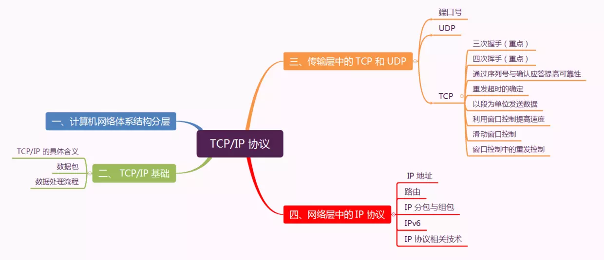
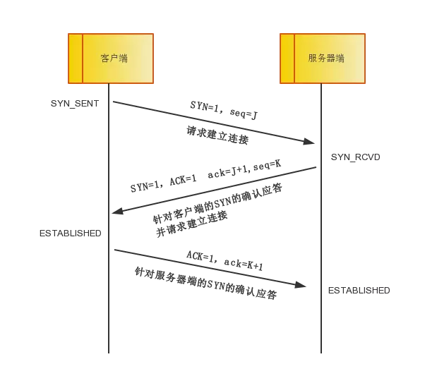
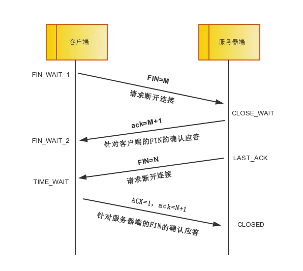

体系图：

#### UDP 的主要特点
- UDP 是无连接的；
- UDP 使用尽最大努力交付，即不保证可靠交付，
- UDP 是面向报文的；
- UDP 没有拥塞控制，因此网络出现拥塞不会使源主机的发送速率降低（对实时应用很有用，如 直播，实时视频会议等）；
- UDP 支持一对一、一对多、多对一和多对多的交互通信；
- UDP 的首部开销小，只有 8 个字节(源端口，目的端口，长度，检验和)

#### TCP的主要特点
- TCP 是面向连接的。（就好像打电话一样，通话前需要先拨号建立连接，通话结束后要挂机释放连接）；
- 每一条 TCP 连接只能有两个端点，每一条 TCP 连接只能是点对点的（一对一）；
- TCP 提供可靠交付的服务。通过 TCP 连接传送的数据，无差错、不丢失、不重复、并且按序到达；
- TCP 提供全双工通信。TCP 允许通信双方的应用进程在任何时候都能发送数据。TCP 连接的两端都设有发送缓存和接收缓存，用来临时存放双方通信的数据；
- 面向字节流。TCP 中的“流”（Stream）指的是流入进程或从进程流出的字节序列。“面向字节流”的含义是：虽然应用程序和 TCP 的交互是一次一个数据块（大小不等），但 TCP 把应用程序交下来的数据仅仅看成是一连串的无结构的字节流。

#### TCP 协议如何来保证传输的可靠性
TCP 提供一种面向连接的、可靠的字节流服务。其中，面向连接意味着两个使用 TCP 的应用（通常是一个客户和一个服务器）在彼此交换数据之前必须先建立一个 TCP 连接。在一个 TCP 连接中，仅有两方进行彼此通信；而字节流服务意味着两个应用程序通过 TCP 链接交换 8bit 字节构成的字节流，TCP 不在字节流中插入记录标识符。
对于可靠性，TCP 通过以下方式进行保证：
- 数据包校验：目的是检测数据在传输过程中的任何变化，若校验出包有错，则丢弃报文段并且不给出响应，这时 TCP 发送数据端超时后会重发数据；
- 对失序数据包重排序：既然 TCP 报文段作为 IP 数据报来传输，而 IP 数据报的到达可能会失序，因此 TCP 报文段的到达也可能会失序。TCP 将对失序数据进行重新排序，然后才交给应用层；
- 丢弃重复数据：对于重复数据，能够丢弃重复数据；
- 应答机制：当 TCP 收到发自 TCP 连接另一端的数据，它将发送一个确认。这个确认不是立即发送，通常将推迟几分之一秒；
- 超时重发：当 TCP 发出一个段后，它启动一个定时器，等待目的端确认收到这个报文段。如果不能及时收到一个确认，将重发这个报文段；
- 流量控制：TCP 连接的每一方都有固定大小的缓冲空间。TCP 的接收端只允许另一端发送接收端缓冲区所能接纳的数据，这可以防止较快主机致使较慢主机的缓冲区溢出，这就是流量控制。TCP 使用的流量控制协议是可变大小的滑动窗口协议。

#### 说一下 TCP 三次握手和四次挥手

##### 建立 TCP 连接需要三次握手 

首先 Client 端发送连接请求报文，Server 段接受连接后回复 ACK 报文，并为这次连接分配资源。Client端接收到 ACK 报文后也向 Server 段发生 ACK 报文，并分配资源，这样 TCP 连接就建立了。
- 第一次握手：客户端将标志位SYN置为1，随机产生一个值seq=J，并将该数据包发送给服务器端，客户端进入SYN_SENT状态，等待服务器端确认。
- 第二次握手：服务器端收到数据包后由标志位SYN=1知道客户端请求建立连接，服务器端将标志位SYN和ACK都置为1，ack=J+1，随机产生一个值seq=K，并将该数据包发送给客户端以确认连接请求，服务器端进入SYN_RCVD状态。
- 第三次握手：客户端收到确认后，检查ack是否为J+1，ACK是否为1，如果正确则将标志位ACK置为1，ack=K+1，并将该数据包发送给服务器端，服务器端检查ack是否为K+1，ACK是否为1，如果正确则连接建立成功，客户端和服务器端进入ESTABLISHED状态，完成三次握手，随后客户端与服务器端之间可以开始传输数据了。

##### 四次挥手
四次挥手即终止TCP连接，就是指断开一个TCP连接时，需要客户端和服务端总共发送4个包以确认连接的断开。在socket编程中，这一过程由客户端或服务端任一方执行close来触发。
由于TCP连接是全双工的，因此，每个方向都必须要单独进行关闭，这一原则是当一方完成数据发送任务后，发送一个FIN来终止这一方向的连接，收到一个FIN只是意味着这一方向上没有数据流动了，即不会再收到数据了，但是在这个TCP连接上仍然能够发送数据，直到这一方向也发送了FIN。首先进行关闭的一方将执行主动关闭，而另一方则执行被动关闭。

中断连接端可以是客户端，也可以是服务器端。
- 第一次挥手：客户端发送一个FIN=M，用来关闭客户端到服务器端的数据传送，客户端进入FIN_WAIT_1状态。意思是说"我客户端没有数据要发给你了"，但是如果你服务器端还有数据没有发送完成，则不必急着关闭连接，可以继续发送数据。
- 第二次挥手：服务器端收到FIN后，先发送ack=M+1，告诉客户端，你的请求我收到了，但是我还没准备好，请继续你等我的消息。这个时候客户端就进入FIN_WAIT_2 状态，继续等待服务器端的FIN报文。
- 第三次挥手：当服务器端确定数据已发送完成，则向客户端发送FIN=N报文，告诉客户端，好了，我这边数据发完了，准备好关闭连接了。服务器端进入LAST_ACK状态。
- 第四次挥手：客户端收到FIN=N报文后，就知道可以关闭连接了，但是他还是不相信网络，怕服务器端不知道要关闭，所以发送ack=N+1后进入TIME_WAIT状态，如果Server端没有收到ACK则可以重传。服务器端收到ACK后，就知道可以断开连接了。客户端等待了2MSL后依然没有收到回复，则证明服务器端已正常关闭，那好，我客户端也可以关闭连接了。最终完成了四次握手。

更多的去看https://juejin.im/post/5a069b6d51882509e5432656#heading-5